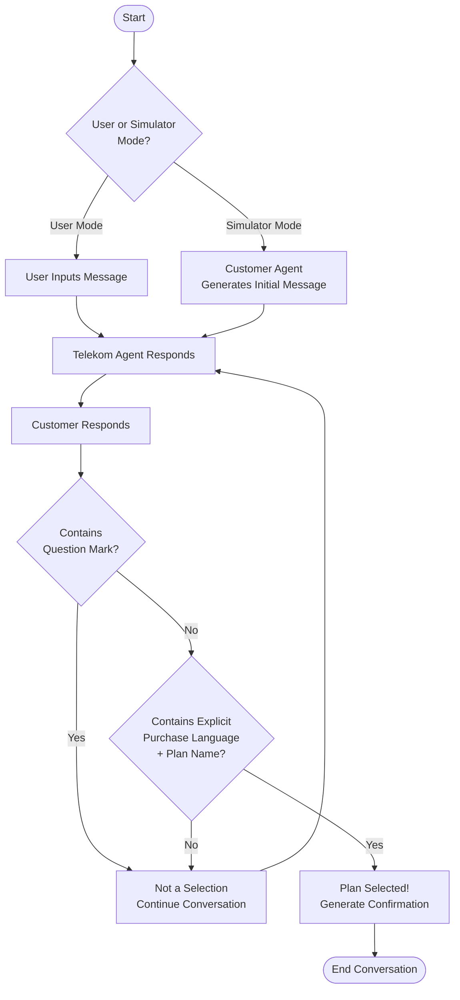
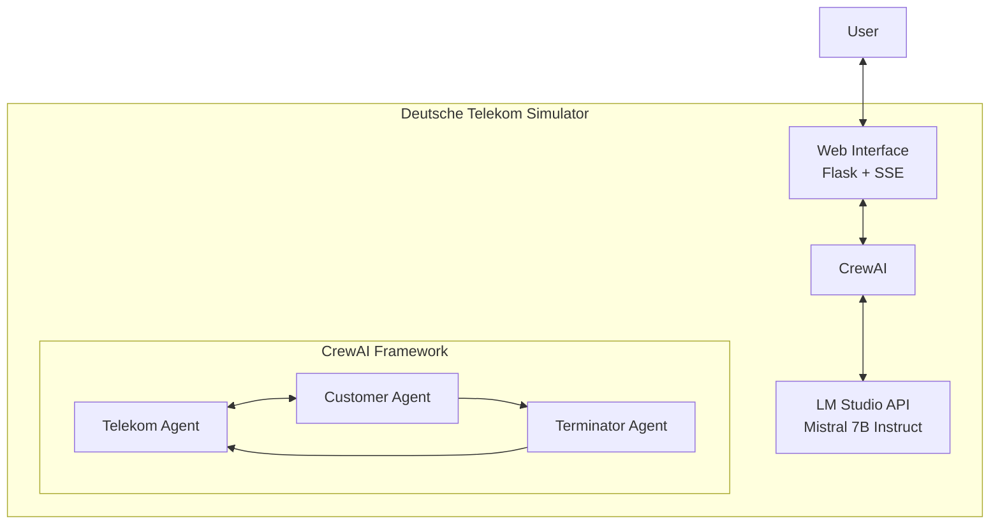
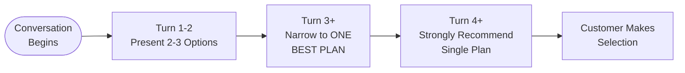
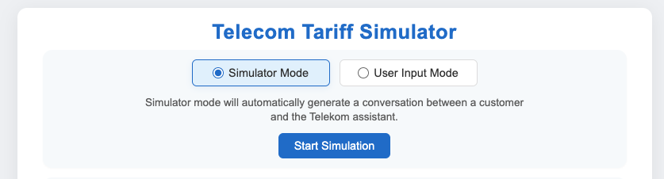
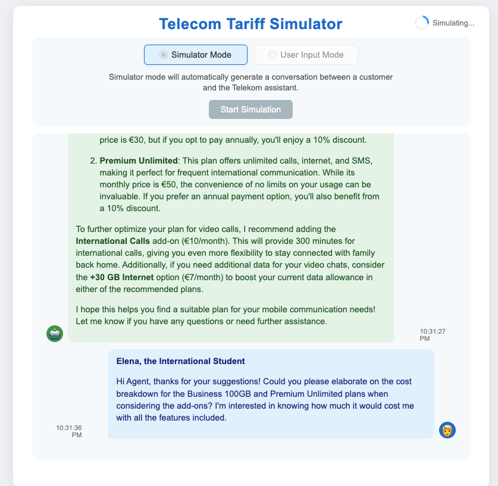

# Deutsche Telekom Tariff Simulator

## Project Background

This project was created as part of a B2B hackathon where I served as a jury member evaluating participants and selecting winners. The simulator was developed to test and demonstrate the capabilities of modern agentic frameworks in a practical business context. As a jury member, I wanted to gain hands-on experience with the technologies being evaluated to better understand their potential applications and limitations.

The simulator demonstrates how AI agents can be used to create realistic, goal-oriented conversations between customers and service representatives, helping customers find the most suitable tariff plan based on their needs while maximizing revenue for Deutsche Telekom.

## Features

- **Dual Mode Operation**:
  - **Simulator Mode**: Automatically generates conversations between AI personas and the Telekom assistant
  - **User Input Mode**: Allows direct interaction with the Telekom assistant

- **Smart Conversation Management**:
  - Real-time conversation simulation
  - Automatic detection of tariff selection
  - Personalized thank you messages
  - Conversation history tracking
  - Session-based state management for multiple browser windows

- **Modern User Interface**:
  - Clean, responsive design
  - Real-time status updates
  - Loading indicators
  - Conversation download functionality
  - Markdown support in messages

## Technical Stack

- **Backend**:
  - Python 3.x with Flask 3.0.2
  - CrewAI 0.11.0 for agent orchestration
  - LM Studio API integration for local LLM inference
  - Optimized for Mistral 7B Instruct v0.3

- **Frontend**:
  - HTML5, CSS3, JavaScript
  - Server-Sent Events (SSE) for real-time updates
  - Responsive design with Flexbox

## Recent Improvements

### 1. Modular Architecture

The project has been restructured into a more professional and intuitive architecture:

- **src/core**: Core utilities like the LM Studio adapter
- **src/agents**: Agent and crew management with CrewAI
- **src/data**: Data files including tariffs, personas, and prompts
- **src/web**: Web application components including Flask app, templates, and static files

This modular structure improves maintainability, readability, and makes the project a better example of professional Python application architecture.

### 2. Enhanced CrewAI Integration

- Created a dedicated `TelekomCrewManager` class to encapsulate CrewAI agent and task management
- Improved task execution with proper error handling, timeouts, and retries
- Better separation of concerns between agent behavior, LLM interaction, and web application logic

### 3. LM Studio Compatibility

- Custom `LMStudioLLM` adapter to handle LM Studio API specifics
- Proper handling of role limitations in LM Studio's API
- Direct LLM calling to avoid compatibility issues with CrewAI's default execution

### 4. Improved Terminator Agent

- Added strict question mark detection to immediately reject messages with questions
- Enhanced plan selection detection with clear purchase language requirements
- Fixed conversation flow to prevent premature termination
- Improved message analysis to properly evaluate actual customer messages

### 5. Progressive Recommendation Strategy

- Early turns (1-2): Present 2-3 options that match initial needs
- Middle turns (3+): Narrow down to one best plan that matches their needs
- Later turns (4+): Strongly recommend a single specific plan with persuasive language

## Project Structure

The project follows a professional, modular structure:

```
├── main.py                # Main entry point for the application
├── run.sh                 # Script to run the application
├── run_tests.sh           # Script to run the test suite
├── test_simulator.py      # Test suite for core components
├── src/                   # Source code directory
│   ├── agents/            # Agent-related modules
│   │   ├── crew_manager.py # CrewAI integration and agent management
│   │   └── __init__.py    # Package initialization
│   ├── core/              # Core functionality
│   │   ├── llm_adapter.py # LM Studio adapter for CrewAI
│   │   └── __init__.py    # Package initialization
│   ├── data/              # Data files and models
│   │   ├── personas.py    # Customer personas
│   │   ├── prompts.py     # Prompt templates for agents
│   │   ├── tariffs.md     # Tariff information
│   │   └── __init__.py    # Package initialization
│   └── web/               # Web application
│       ├── app.py         # Flask application
│       ├── static/        # CSS, JS, and images
│       ├── templates/     # HTML templates
│       └── __init__.py    # Package initialization
├── .env                   # Environment configuration
├── requirements.txt       # Python dependencies
└── conversation_history/  # Saved conversations
```

## Multi-Agent Architecture

The simulator uses three specialized AI agents:

1. **Telekom Agent**:
   - Helps customers find the best mobile plan
   - Uses progressive narrowing approach for recommendations
   - Responds directly to customer questions and needs
   - Balances customer satisfaction with revenue maximization

2. **Customer Agent** (Simulator Mode Only):
   - Simulates different customer personas with specific needs
   - Asks relevant questions about plans
   - Makes decisions based on how well plans meet their needs
   - Avoids repetitive messages and progresses the conversation naturally

3. **Terminator Agent**:
   - Determines if a customer has explicitly selected a plan
   - Uses strict criteria to detect genuine plan selections
   - Immediately rejects messages containing question marks
   - Requires explicit purchase language and specific plan mention

## Workflow Diagrams

### Conversation Flow

The following diagram illustrates the conversation flow in the Deutsche Telekom Tariff Simulator, showing how messages are processed and how plan selections are detected:



### Agent Architecture

This diagram shows how the three agents interact with each other and with the LM Studio API within the CrewAI framework:



### Progressive Recommendation Strategy

The Telekom Agent uses a progressive narrowing approach to recommendations as the conversation advances:



## Running the Application

### Prerequisites

- Python 3.x
- LM Studio with Mistral 7B Instruct v0.3 (or compatible model)
- LM Studio API server running on port 1234

### Installation

1. Clone the repository:
   ```bash
   git clone [repository-url]
   cd [repository-name]
   ```

2. Install dependencies:
   ```bash
   pip install -r requirements.txt
   ```

3. Configure environment variables in `.env` file:
   ```
   LMSTUDIO_BASE_URL="http://127.0.0.1:1234/v1"
   LMSTUDIO_MODEL_NAME="mistral-7b-instruct-v0.3"
   PORT=5001
   ```

4. Run the application:
   ```bash
   ./run.sh
   ```

5. Open your browser and navigate to:
   ```
   http://localhost:5001
   ```

### Testing

Run the test suite to verify all components are working properly:
```bash
./run_tests.sh
```

## Screenshots

### Simulator Interface


### Conversation Example


## License

This project is provided for educational and demonstration purposes.
(Therefore also .env is in source control - I know it's not a good practice.)
