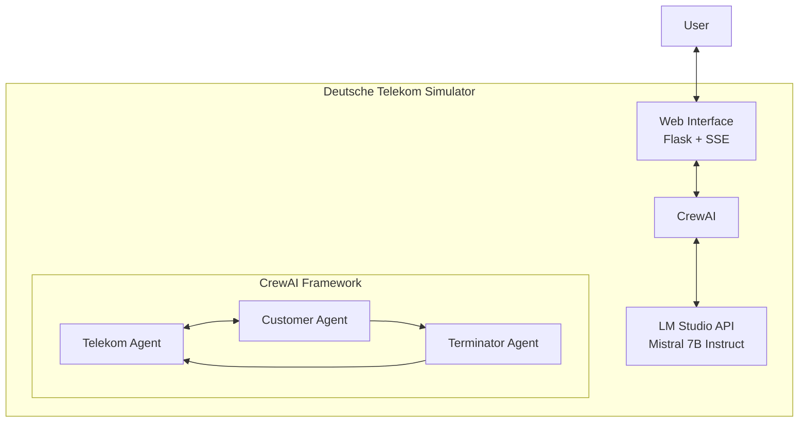

```mermaid
flowchart TD
    subgraph "Deutsche Telekom Simulator"
        LLM[LM Studio API\nMistral 7B Instruct]
        
        subgraph "CrewAI Framework"
            TA[Telekom Agent]
            CA[Customer Agent]
            TER[Terminator Agent]
            
            TA <--> CA
            CA --> TER
            TER --> TA
        end
        
        UI[Web Interface\nFlask + SSE]
        
        CrewAI <--> LLM
        UI <--> CrewAI
    end
    
    User[User] <--> UI
```
