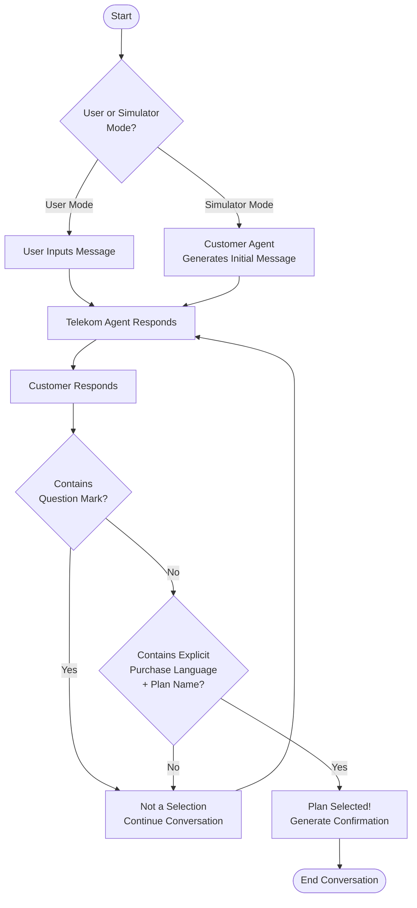

```mermaid
flowchart TD
    Start([Start]) --> UserMode{User or Simulator\nMode?}
    UserMode -->|User Mode| UserInput[User Inputs Message]
    UserMode -->|Simulator Mode| SimulatedCustomer[Customer Agent\nGenerates Initial Message]
    
    UserInput --> TelekomResponse[Telekom Agent Responds]
    SimulatedCustomer --> TelekomResponse
    
    TelekomResponse --> CustomerResponse[Customer Responds\n]
    
    CustomerResponse --> QuestionCheck{Contains\nQuestion Mark?}
    QuestionCheck -->|Yes| NoSelection[Not a Selection\nContinue Conversation]
    QuestionCheck -->|No| PurchaseCheck{Contains Explicit\nPurchase Language\n+ Plan Name?}
    
    PurchaseCheck -->|Yes| Selection[Plan Selected!\nGenerate Confirmation]
    PurchaseCheck -->|No| NoSelection
    
    NoSelection --> TelekomResponse
    Selection --> End([End Conversation])
```
