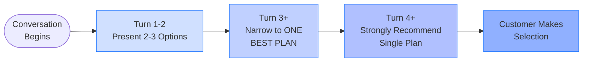

```mermaid
flowchart LR
    Start([Conversation\nBegins]) --> Turn1[Turn 1-2\nPresent 2-3 Options]
    Turn1 --> Turn3[Turn 3+\nNarrow to ONE\nBEST PLAN]
    Turn3 --> Turn4[Turn 4+\nStrongly Recommend\nSingle Plan]
    Turn4 --> Selection[Customer Makes\nSelection]
    
    style Turn1 fill:#d0e0ff,stroke:#3080ff
    style Turn3 fill:#c0d0ff,stroke:#3080ff
    style Turn4 fill:#b0c0ff,stroke:#3080ff
    style Selection fill:#90b0ff,stroke:#3080ff
```
